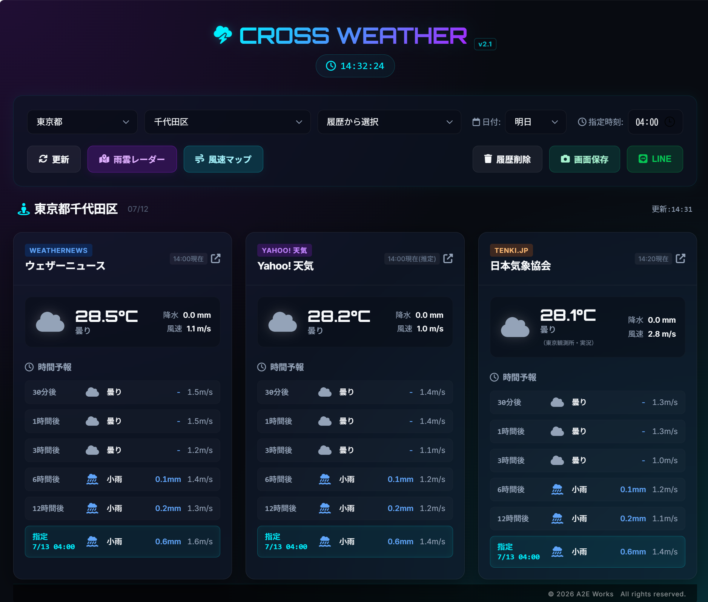
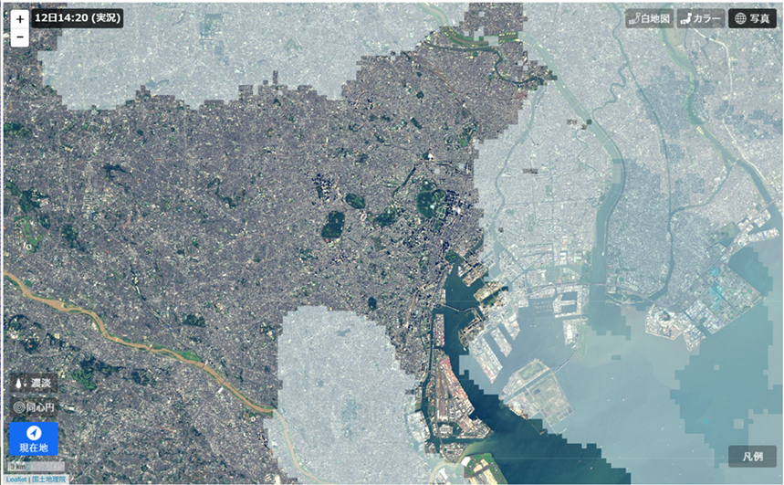
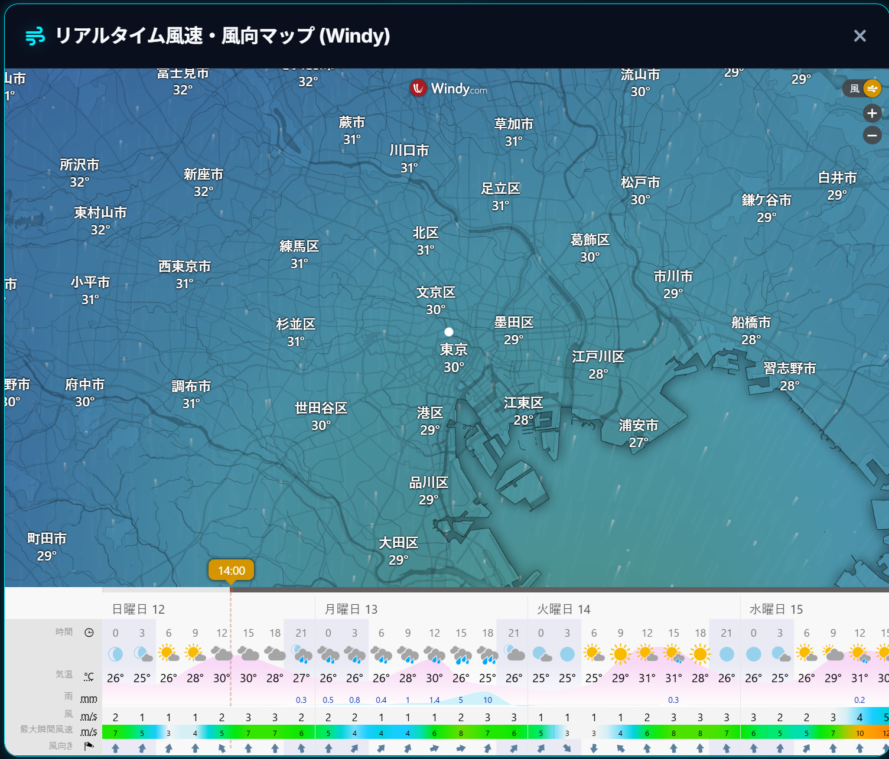

# ☀️ Weather Cross

A2E Works Portfolio

現場判断を支援する天気情報横断ダッシュボードです。

---

## 開発背景

屋外業務では

30分、1時間後の降雨、風速で判断が変わります。

複数の気象サイトを切り替えて確認する運用だったため、
必要情報を一画面へ集約するダッシュボードを開発しました。

---

## 解決した課題

- 複数サイトを巡回する時間を削減
- 雨雲の変化を即確認
- 現場判断を高速化
- 判断、情報共有ミス防止

---
## Screenshots

### Main Screen

### Rain Radar

### Wind Information

---
## 主な機能

✅ 気象サイト横断表示

✅ 雨雲レーダー

✅ 降水情報

✅ 風情報

✅ 画面保存対応

✅ LINE対応

✅ モバイル対応

✅ PWA対応

---

## 利用イメージ

屋外作業

・ドローン業務

・設備点検

・屋根点検

・測量

などで利用を想定しています。

---

## Demo

GitHub Pages:

https://a2e-works.github.io/weather-cross-app/

---

## License

© A2E Works

Portfolio purposes only.

All Rights Reserved.
